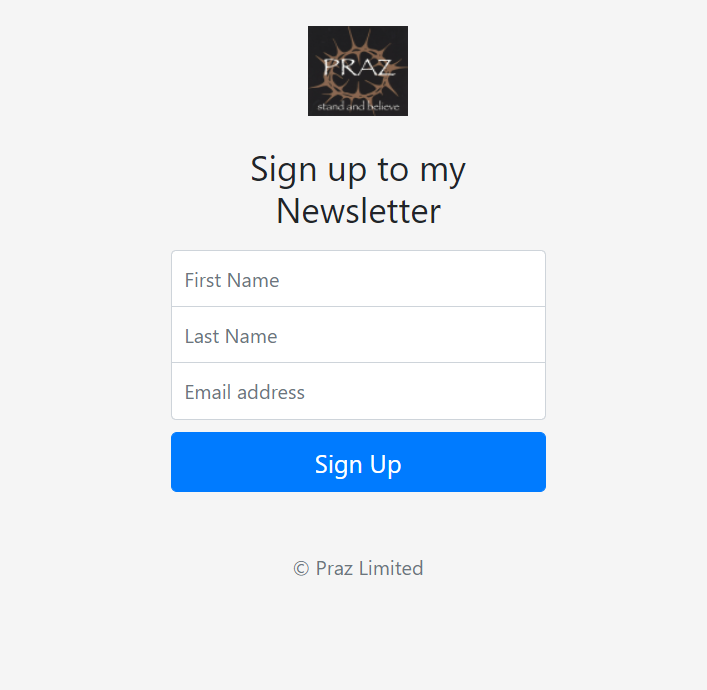

# mailChimp-newsLetter-signup
A small (but working) nodejs and expressjs newsletter app, deployed to Heroku.

## Table of contents

- [Overview](#overview)
  - [Description](#description)
  - [Screenshot](#screenshot)
  - [Links](#links)
- [My process](#my-process)
  - [Built with](#built-with)

## Overview

### Description

This server-side project uses Mailchimp's API to create a working, real-world newsletter sign-up form application. This JavaScript project form is actually integrated 
with this site's newsletter sign-up campaign, so if you haven't already done so, sign up to my <a href="https://safe-river-82427.herokuapp.com/>Mailchimp Newsletter</a>

### Screenshot

### Links

- Project URL: https://safe-river-82427.herokuapp.com/ 
- Github Source Files: https://github.com/prasanta10/mailChimp-newsLetter-signup

## My process

### Built with

- Node JS
- Express JS
- Mailchimp API
- npm modules (body-parser, request)
- Basic HTML
- Intermediate CSS
